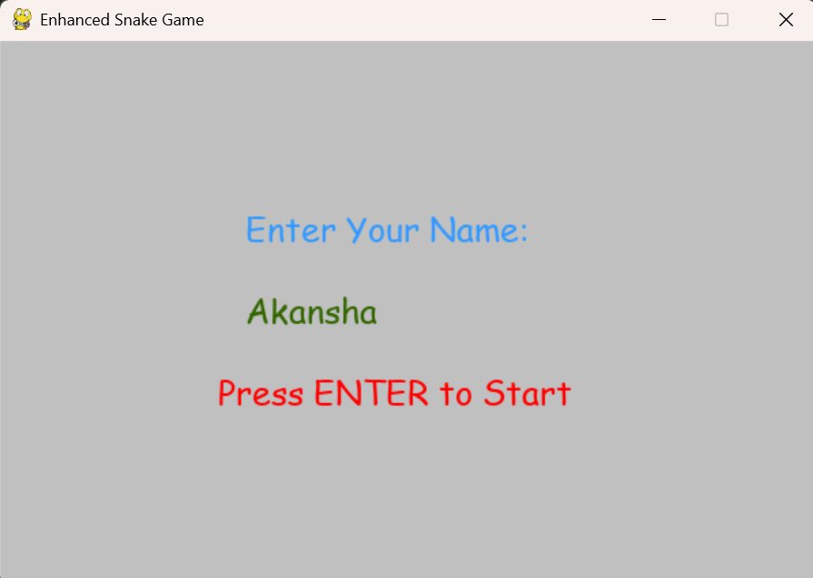
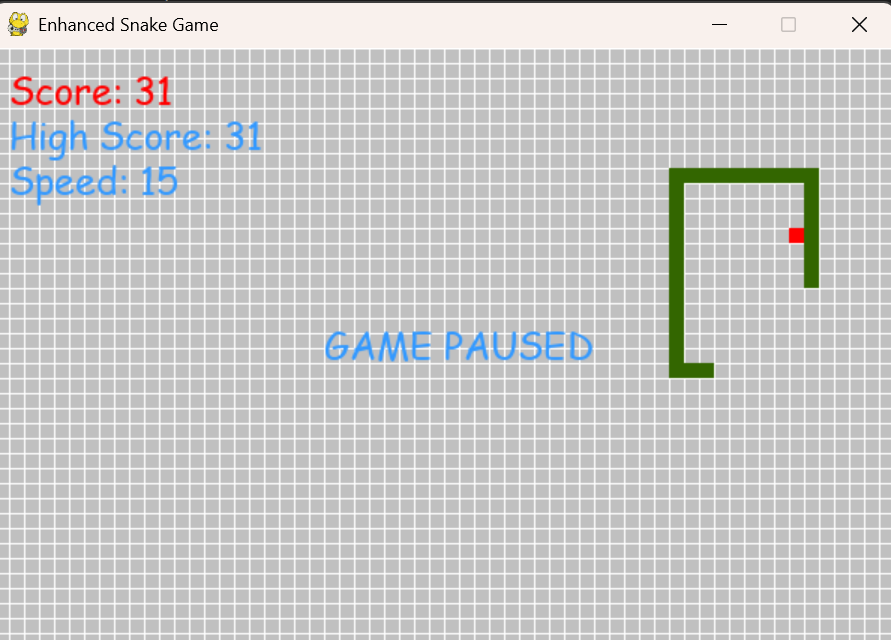
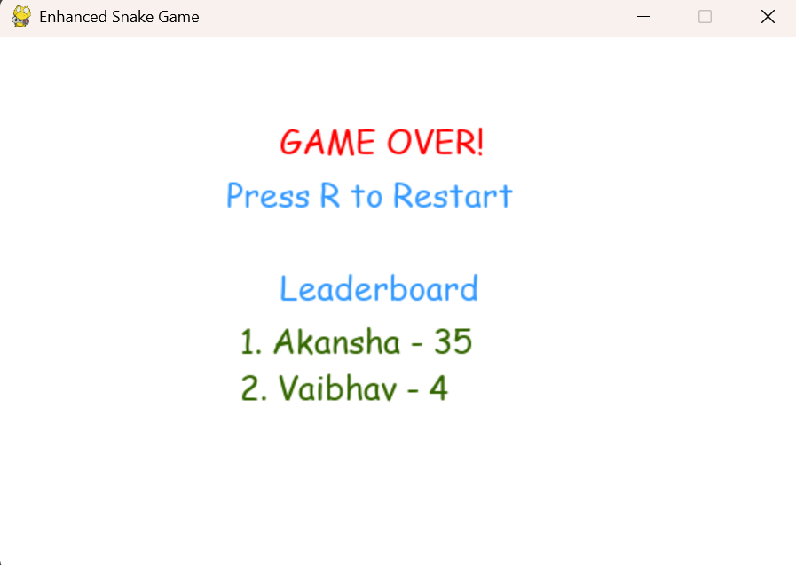

# 🐍 Snake Game using Pygame

A classic Snake Game built using Python and Pygame featuring real-time gameplay, collision detection, score tracking, a leaderboard system powered by SQLite database integration, and a deterministic **AI Autoplay mode** powered by BFS pathfinding.

## 📸 Screenshots

| Gameplay | Game Over Screen | Leaderboard |
|:---:|:---:|:---:|
|  |  |  |


---

## 🎮 Features
- Real-time Snake gameplay using Pygame
- Fullscreen display, auto-scaled to your monitor's native resolution
- Smooth game loop with FPS control
- Boundary collision detection
- Self-collision detection
- Game Over screen shows the exact reason (wall vs. self-collision)
- Dynamic score tracking
- Leaderboard system using SQLite database
- Session-based leaderboard updates
- Pause and Resume functionality
- Restart game using keyboard controls
- Adjustable difficulty (game speed) via keyboard
- **AI Autoplay mode** — toggle with `A` to let the game play itself using BFS pathfinding
- On-screen visualization of the AI's currently planned path
- Centered menus (name entry, game over/leaderboard) and a dedicated top status ribbon for score, speed, mode, and controls

---

## 🛠 Tech Stack
- Python
- Pygame
- SQLite3
- Breadth-First Search (BFS) — deterministic pathfinding for the AI agent


---

## 📁 Project Structure

```text
Snake-Game-Pygame/
│
├── ai/
│   ├── __init__.py
│   ├── ai_agent.py       # AI decision logic (BFS + fallback survival strategy)
│   ├── pathfinding.py    # BFS shortest-path implementation
│   └── utils.py          # Grid/direction helper functions
├
|── assets/
│   ├── fonts/
│   ├── sounds/
│   └── images/
│
├── database/
│   └── leaderboard.db
│
├── src/
│   ├── database.py
│   ├── food.py
│   ├── game.py
│   ├── settings.py
│   └── snake.py
├
|── main.py
├── highscore.txt
├── requirements.txt
├── README.md
└── .gitignore
```

---

## 🎯 Controls

| Key | Action |
|-----|--------|
 Arrow Keys | Move Snake (Manual mode) |
| A | Toggle AI Autoplay mode on/off |
| P | Pause / Resume |
| R | Restart Game (from Game Over screen) |
| 1 / 2 / 3 | Set difficulty (Slow / Medium / Fast) |
| ESC | Quit Game |

---

## 🚀 How to Run
### 1️⃣ Clone the repository
```bash
git clone https://github.com/Akansha-08/Snake-Game-Pygame.git
cd Snake-Game-Pygame
```

### 2️⃣ Install dependencies
```bash
pip install pygame
```

### 3️⃣ Run the game
```bash
python main.py
```

---

## 🎮 Gameplay Features

### 💥 Collision System
- Detects wall collisions (including the top status ribbon, which is a real boundary, not just a visual overlay)
- Detects self-collision with snake body
- Game Over screen displays the specific reason for the collision

### 🏆 Leaderboard
- Stores player names and scores
- Uses SQLite database integration
- Displays leaderboard on Game Over screen, centered on screen

### ⏸️ Game Controls
- Pause and Resume support
- Restart functionality
- Smooth keyboard controls
- Adjustable difficulty (speed) at any time during play

### 🤖 AI Autoplay Mode
- Toggle instantly with the `A` key — manual controls remain fully functional when AI mode is off
- Every frame, BFS computes the shortest safe path from the snake's head to the food, treating the snake's own body as obstacles
- If no path to the food currently exists, a fallback strategy picks any move that keeps the snake alive (avoiding walls, its own body, and instant reversals)
- The AI's currently planned path is drawn on screen for visualization
- Purely deterministic search — no machine learning or reinforcement learning involved

---

## 🔮 Future Improvements
- Sound effects
- Start menu
- Particle animations
- Theme system
- Background music
- Mouse-based buttons
- Configurable AI speed / step-by-step AI mode for demonstrations
- A* or other pathfinding algorithms as alternate AI strategies

---

## 📚 Learning Outcomes
- Game loops
- Event handling
- Object-oriented programming
- Collision detection
- Database integration
- File organization
- UI enhancement in games
- Graph algorithms (BFS) applied to real-time pathfinding
- Building deterministic AI agents without machine learning
- Fullscreen/responsive display handling based on screen resolution

---

## 👩‍💻 Author

**Akansha**
B.Tech CSE Student

This project was developed as part of my Python learning journey to strengthen core programming and game development fundamentals.